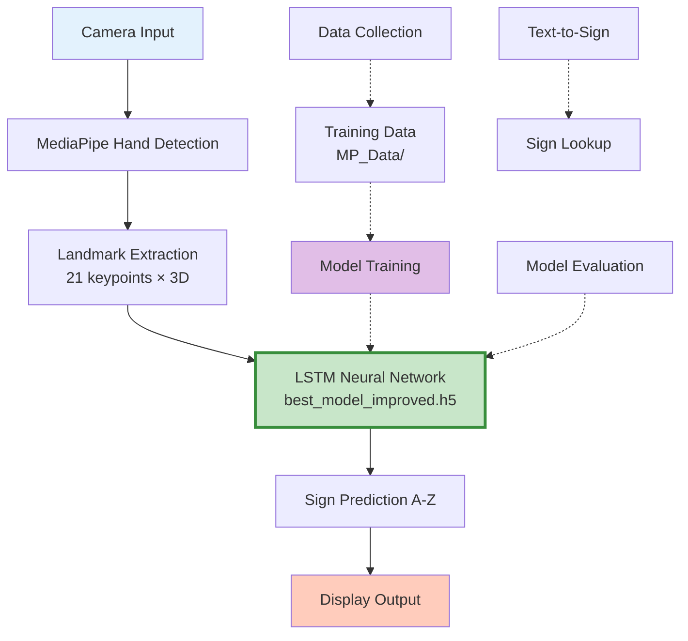
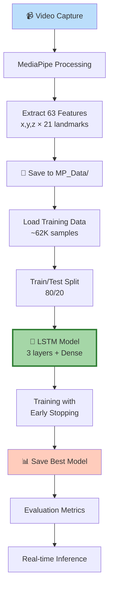

# ASL Detector Diagrams (Mermaid.js)

## Architecture Diagram (Mermaid)

```mermaid
graph TB
    A[Camera Input] --> B[MediaPipe Hand Detection]
    B --> C[Landmark Extraction<br/>21 keypoints × 3D]
    C --> D[LSTM Neural Network<br/>best_model_improved.h5]
    D --> E[Sign Prediction A-Z]
    E --> F[Display Output]
    
    G[Data Collection] -.-> H[Training Data<br/>MP_Data/]
    H -.-> I[Model Training]
    I -.-> D
    
    J[Text-to-Sign] -.-> K[Sign Lookup]
    L[Model Evaluation] -.-> D
    
    style D fill:#c8e6c9,stroke:#388e3c,stroke-width:3px
    style A fill:#e3f2fd
    style F fill:#ffccbc
    style I fill:#e1bee7
```

## Data Processing Flow (Mermaid)

```mermaid
flowchart TD
    A[📹 Video Capture] --> B[MediaPipe Processing]
    B --> C[Extract 63 Features<br/>x,y,z × 21 landmarks]
    C --> D[💾 Save to MP_Data/]
    D --> E[Load Training Data<br/>~62K samples]
    E --> F[Train/Test Split<br/>80/20]
    F --> G[🧠 LSTM Model<br/>3 layers + Dense]
    G --> H[Training with<br/>Early Stopping]
    H --> I[📊 Save Best Model]
    I --> J[Evaluation Metrics]
    J --> K[Real-time Inference]
    
    style G fill:#a5d6a7,stroke:#2e7d32,stroke-width:3px
    style A fill:#bbdefb
    style I fill:#ffccbc
```
